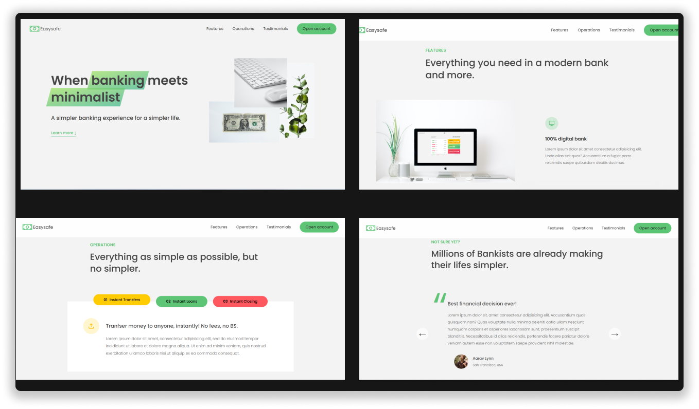

## Bank Marketing Web Page -- Easysafe 

 > Welcome to Easysafe. This web page is designed to showcase the bank's services and promotions using HTML, CSS, and JavaScript. It features various cool effects, including sliding comments and a navbar blur effect on hover. Read on to learn more about the features and how to use this web page.

### Demo Screeshots

### Table of Contents
- **Demo**
- **Features**
- **Usage**
- **Contributing**

### Demo
A live demo of the Bank Marketing Web Page can be found  <a href="https://easysafe.netlify.app/"><strong>➥ Live Demo</strong></a>

### Features
- **Sliding Comments**: Engage your users with dynamic sliding comments that showcase positive feedback from our happy customers.

- **Navbar Blur Effect**: The navbar background blurs elegantly when users hover over the navigation links, providing a sleek user experience.

### Usage
To use this web page locally, follow these instructions:

> Clone the repository: git clone https://github.com/leonard-ibeh/easysafe.git

> Navigate to the project directory: cd easysafe

### Contributing
We welcome contributions to improve and expand the Bank Marketing Web Page. If you'd like to contribute, please follow these steps:

1. Fork the repository on GitHub.
2. Create a new branch with a descriptive name: git checkout -b feature/new-feature or git checkout -b bug/bug-fix.
3. Make your changes and commit them: git commit -m "Description of changes".
4. Push your changes to your forked repository: git push origin feature/new-feature.
5. Open a pull request on the original repository and describe your changes in detail.

Thank you for using **Easysafe**. If you encounter any issues or have suggestions for improvement, feel free to open an issue or get in touch with our team. We hope you enjoy using this web page and find it beneficial for showcasing our bank's services and promotions!
